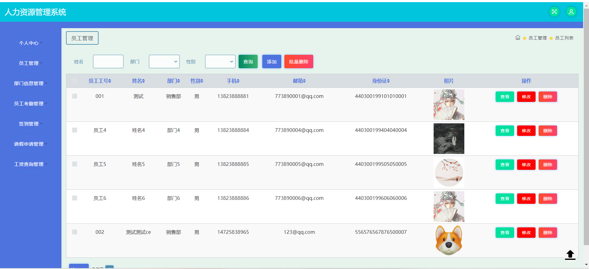
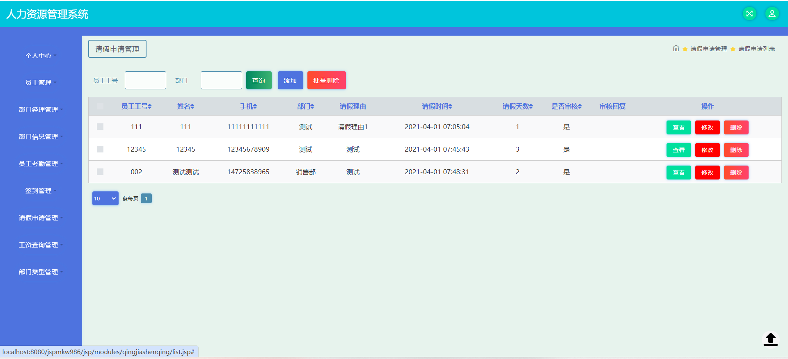

# human-resource-manager🎂

基于SSM+JSP的人力资源管理系统

## 介绍🌞

> 本系统前端主要基于JSP技术构建，以确保用户界面的动态性和交互性。为了高效、稳定地存储系统数据，我们选择了MySQL数据库作为后端支持。本系统由多个模块组成，包括登录模块、管理者模块、员工模块和部门模块。登录模块负责用户身份验证，确保系统安全。管理者模块赋予管理员权限，允许他们修改员工信息和部门信息。员工模块则提供员工个人信息查看和部分修改的功能。部门模块不仅展示部门结构，还允许部门管理者对其下属员工进行管理。

## 软件架构🌞

+ 个人中心：修改账号密码，修改个人信息

+ 员工管理：对员工信息进行增删改查

+ 部门管理：可以增加，删除，修改部门分类，可以对部门的信息进行修改，可以对部门所属员工进行管理。

+ 工资模块：可以对工资进行查询，管理员可以对工资进行登记，对考勤等安排可以进行查看，并依次为基础计算薪资

+ 请假申请模块：业务功能包括请假申请，请假审批流程等等

## 项目演示🌞

> 员工管理：

对员工信息进行增删改查



> 部门管理：

可以增加，删除，修改部门分类，可以对部门的信息进行修改，可以 对部门所属员工进行管理。


> 工资模块

可以对工资进行查询，管理员可以对工资进行登记，对考勤等安排可 以进行查看，并依次为基础计算薪资


> 请假申请模块

业务功能包括请假申请，请假审批流程等等



## 安装教程🌞

```
1. 运行环境准备mysql8 + java8

2. 配置maven路径，加载依赖

3. 运行sql文件，确保application.yml或config.properties的数据库名称和账号密码是数据库所在主机的账号密码
```


## 使用说明🌞

```
1. 登入
	管理员账号：admin	密码：admin
   
	员工账号：001	密码：000000
   
	部门经理账号：001 密码:123456
  
2. 运行流程

SpringBoot+Vue项目的部署详情可以查看这篇CSDN博客：http://t.csdnimg.cn/kpuxS

前后端不分离项目的部署流程可以查看这篇CSDN博客：http://t.csdnimg.cn/CslA5
```


## CSDN项目合集🌞

点击前往：http://t.csdnimg.cn/Q4u84


## 联系我🌞

**有偿获取完整源码或调试代码**

🐧：1902317191

we-chat：coding1902317191
